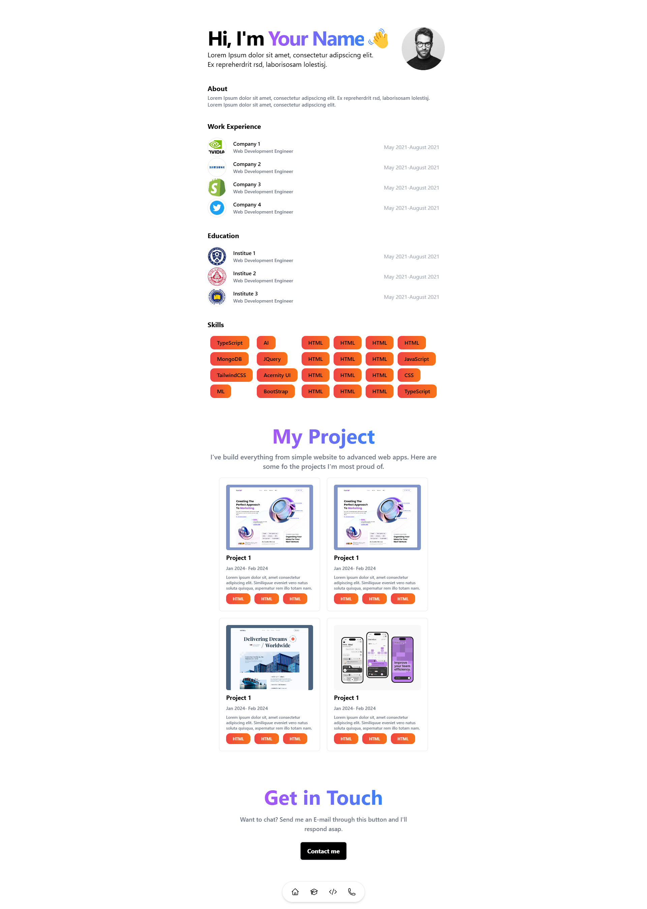

# 🌟 Minimal Modern Portfolio

This project showcases a sleek and simple personal portfolio website, built with **React.js** and styled using **Tailwind CSS**. It’s designed to make your personal brand stand out with a clean, modern look.

🔗 Live Site: https://modern-minimial-portfolio-template.netlify.app/

 

## 🚀 Features

- **Responsive Design** 🌐: Fits beautifully on any device, whether desktop, tablet, or mobile.
- **Modern Aesthetics** 🎨: Simple yet striking with a minimalistic design approach.
- **Smooth Animations** ✨: Subtle animations to enhance user interaction.
- **Easy Customization** 🛠️: Modify content, colors, and layout with ease.
- **Optimized Performance** ⚡: Fast loading speeds to enhance the user experience.

## 🛠️ Tech Stack

- **React.js** ⚛️
- **Tailwind CSS** 🌬️
- **JavaScript** 📜
- **Vite** 🖌️

## 🖥️ How to Run the Project

1. **Clone the repository**:
   ```bash
   git clone https://github.com/jishantukripal/Minimial-PortFolio-Template.git
   ```

2. **Navigate into the project directory**:
   ```bash
   cd Minimial-PortFolio-Template
   ```

3. **Install dependencies**:
   ```bash
   npm install
   ```

4. **Run the development server**:
   ```bash
   npm run dev
   ```
   Your portfolio should now be running on `http://localhost:5173`

## ⚙️ Customization Guide

1. **Components**: Modify text, images, and icons in the `components` folder to personalize each section of your portfolio.
2. **Colors & Fonts**: Customize the `tailwind.config.js` file to fit your style.
3. **Animations**: Use Tailwind CSS classes to add/remove animations as you prefer.

## 🤝 Contributing

If you'd like to contribute or have suggestions, feel free to fork the repo and submit a pull request. Contributions are always welcome!
